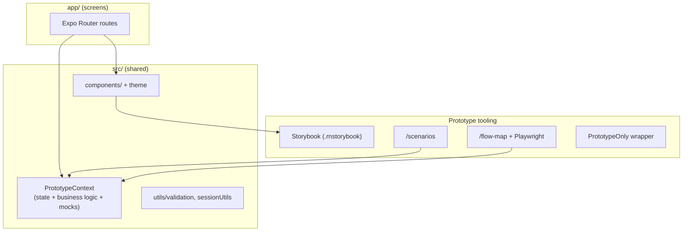
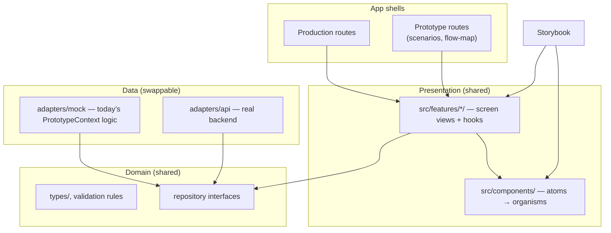

# Prototype → production migration

How to evolve Rokjam from the Stage 1 in-memory prototype to a production mobile app while keeping shared UI, Storybook, and prototype QA tooling (scenario tester, flow map).

This is **not** a separate “web prototype → new mobile app” rewrite. The repo is already an **Expo v56** app (iOS, Android, web). The transition is: **mock in-memory state → real auth + persistence**, with a swappable data layer and thin screens.

Related docs:

- [Standards.md](./tickets/Standards.md) — UI and flow rules (unchanged in production)
- [DesignSystem.md](./tickets/DesignSystem.md) — tokens and components
- [Testing.md](./tickets/Testing.md) — scenario tester and flow map
- [AGENTS.md](../AGENTS.md) — agent workflow when changing flows

---

## Current architecture



### Strengths (keep)

| Area | Location | Role |
| --- | --- | --- |
| Design system | `src/components/`, `src/theme/` | Atoms → organisms; Storybook stories |
| Routing | `app/` | Expo Router file-based screens |
| Flow specs | `docs/tickets/Flow/` | Acceptance criteria per journey |
| QA | `app/scenarios.tsx`, `app/flow-map.tsx` | Scenario tester + visual flow map |
| Pure logic | `src/utils/validation.ts`, `sessionUtils.ts` | Validation and formatting |

### Main gap (addressed in Phase 2)

`PrototypeContext` previously combined UI state, domain behaviour, and mock backend in one place. Phase 2 extracted that into:

1. **Domain ports** — `AuthRepository`, `ProfileRepository`, `SessionRepository`, `CommunityRepository`
2. **Mock adapter** — `src/adapters/mock/MockAppDataProvider.tsx`
3. **Domain hooks** — `useAuth`, `useProfile`, `useSessions`, `useCommunity`, `useMockSeeding`

Feature hooks now depend on domain hooks, not `usePrototype()`. Prototype tooling (scenarios, flow map) uses `useMockSeeding` and `useAuth` directly.

Phase 4 will add `adapters/api/` against the same ports — UI unchanged.

---

## Target architecture

**One git repo.** Split by **layer** (folders under `src/`), not duplicate UI or separate repositories.



### Layer responsibilities

| Layer | Purpose | Prototype | Production |
| --- | --- | --- | --- |
| **Components** | Reusable UI; no data fetching | Shared | Shared |
| **Features** | Screen views + hooks; compose components | Shared | Shared |
| **Domain** | Types, validation, repository interfaces | Shared | Shared |
| **Adapters** | Auth, profile, sessions, community | In-memory mock | API + local cache |
| **App routes** | Expo Router shells in `app/`; wire hooks to views | All routes | Product routes only |

**Target folder layout** (same repo, same `package.json`):

```
rokjam/                        # one git repo
  app/                         # Expo Router — thin route shells
  src/
    components/ + theme/       # shared UI (Storybook targets this)
    features/                  # screen views + hooks per flow
    domain/                    # types, validation, repository ports
    adapters/
      mock/                    # in-memory — from PrototypeContext
      api/                     # real backend (Phase 4)
    data/
      AppDataProvider.tsx      # wires mock vs api; exposes hooks
  docs/                        # flow tickets, Standards, this doc
  scripts/                     # flow map, CI
  .rnstorybook/
```

**Import direction:**

```
app/ → features/ → components/
                 → domain/
adapters/* → domain/
components/ → (no imports from features, app, or adapters)
domain/ → (no React, no Expo)
```

### Storybook vs scenario tester

| Tool | Scope | Keep? |
| --- | --- | --- |
| **Storybook** (`.rnstorybook/`) | Component and view isolation with mock props | Yes — design system |
| **Scenario tester** (`/scenarios`) | Full journeys with mock state | Yes — integration QA |
| **Flow map** (`/flow-map`) | Screen registry + PNG capture | Yes — docs and review |

Do not merge these; they solve different problems.

---

## Phased migration

Work **flow-by-flow** (auth → sessions → dashboard → community). Update matching flow tickets and run `npm run check` after each slice.

### Phase 1 — Stabilize shared UI

**Goal:** Treat `src/components/` + `src/theme/` as the product UI surface. Screens become thin.

**Pattern:**

```tsx
// app/dashboard.tsx — thin route shell
export default function DashboardScreen() {
  return <DashboardView {...useDashboard()} />;
}

// src/features/dashboard/DashboardView.tsx — presentational, Storybook-testable
export function DashboardView(props: DashboardViewProps) {
  /* compose Screen, Section, Card, etc. */
}
```

**Actions:**

- [ ] When touching a screen, extract a `*View` component and a `use*` hook
- [ ] Add Storybook stories for views with **mock props** (extend `src/components/storybook.helpers.tsx`)
- [ ] Keep routing, demo query params (`?demo=`), and navigation in `app/` only
- [ ] Continue [Standards.md](./tickets/Standards.md) and flow ticket checkboxes

**Effort:** Incremental. **Payoff:** Production and prototype share the same pixels.

---

### Phase 2 — Repository interfaces

**Goal:** Screens depend on domain hooks, not `usePrototype()`.

**Define ports** (names illustrative; adjust to match backend):

| Port | Covers today’s `PrototypeContext` |
| --- | --- |
| `AuthRepository` | Login, signup, verify email, forgot/reset password |
| `ProfileRepository` | Username, avatar, locations, levels, tags, profile completeness |
| `SessionRepository` | Start/update/complete/delete sessions; climbs CRUD |
| `CommunityRepository` | Public feed, follows |

**Suggested layout:**

```
src/
  domain/
    types/              # move or re-export from src/types/
    validation/         # re-export from src/utils/validation.ts
    ports/              # AuthRepository, SessionRepository, …
  adapters/
    mock/               # in-memory — extracted from PrototypeContext
    api/                # real HTTP/SDK calls (Phase 4)
  features/
    auth/
    profile/
    sessions/
    dashboard/
    community/
  data/
    AppDataProvider.tsx # selects mock vs api adapters; exposes hooks
```

**Hook examples (target API):**

```tsx
const { user, signIn, signOut } = useAuth();
const { profile, locations, updateLocation } = useProfile();
const { sessions, startSession, getSession } = useSessions();
```

**Actions:**

- [x] Move domain types out of `PrototypeContext` exports where practical
- [x] Split `PrototypeContext` into mock adapter modules
- [x] Add `AppDataProvider` that wires mock adapters (prototype mode first)
- [x] Migrate screens from `usePrototype()` to domain hooks, one flow at a time
- [x] Keep seed helpers (`seedFlowDemo`, `seedReturningUser`, etc.) on the **mock adapter** for scenario tester

**Effort:** Medium. **Payoff:** Backend becomes a swap, not a rewrite.

---

### Phase 3 — Dual runtime, one repo

**Goal:** Prototype tooling and production builds coexist in the **same Expo app** and git repo.

**App mode** (env var, EAS profile, or `app.config` variant):

| Mode | Routes | Data | Audience |
| --- | --- | --- | --- |
| `prototype` | All product routes + `/scenarios`, `/flow-map`, utility pages | Mock adapters | Design, QA, stakeholders |
| `production` | Product routes only | API adapters | App Store / Play Store |

**Actions:**

- [x] Introduce `APP_MODE` (e.g. `EXPO_PUBLIC_APP_MODE=prototype|production`)
- [x] Gate prototype-only UI with `PrototypeOnly` and/or route registration
- [x] Exclude prototype routes from production builds where possible
- [x] Keep web as the fast prototype surface; use **EAS Build** early for device testing
- [x] Document mode switching in [Testing.md](./tickets/Testing.md) when implemented

**Effort:** Small once Phase 2 exists. **Payoff:** One repo, shared components, two deliverables.

---

### Phase 4 — Production backend

**Goal:** Implement `adapters/api/*` against the same ports. UI unchanged.

**Backend choice** (product decision, not UI):

- **Supabase / Firebase** — faster auth + database + optional sync
- **Custom API** — more control, more operational work

**Production concerns:**

| Concern | Approach |
| --- | --- |
| Auth tokens | `expo-secure-store` |
| Network + cache | TanStack Query (or similar) behind repository hooks |
| Offline / active session | Cache + optimistic updates in session adapter |
| Address search | Real geocoding/places API behind existing `AddressSearch` |
| Errors / loading | Handled in feature hooks; views receive `isLoading`, `error` props |

**Actions:**

- [ ] Implement API adapters per port
- [ ] Add integration tests against staging API
- [ ] Remove or hide mock credentials from production builds
- [ ] Keep mock adapters for Storybook, scenario tester, and CI without backend

**Effort:** Depends on backend. **Payoff:** Store-ready app with unchanged components.

---

### Phase 5 — Store-ready polish

**Actions:**

- [ ] Push notifications, deep links (Expo linking)
- [ ] App icons, splash, store metadata (`app.config`)
- [ ] Error boundaries and empty states at view layer
- [ ] CI: retain `npm run check`; add EAS build on main
- [ ] Privacy policy, account deletion, etc. (product/legal)

---

## Recommended slice order

Migrate **end-to-end** in this order (each slice: view → port → mock adapter → API adapter):

1. **Auth** — Sign up / login / verify ([SignUpLogin.md](./tickets/Flow/SignUpLogin.md))
2. **Profile** — Setup, locations, levels ([MemberProfile.md](./tickets/Flow/MemberProfile.md))
3. **Sessions** — Create, active, view/edit ([ClimbingSessionCreate.md](./tickets/Flow/ClimbingSessionCreate.md), [ClimbingSessionViewEdit.md](./tickets/Flow/ClimbingSessionViewEdit.md))
4. **Dashboard / insights** — Read-heavy ([Dashboard.md](./tickets/Flow/Dashboard.md))
5. **Community** — Feed, follows ([Community.md](./tickets/Flow/Community.md))

Sessions are the highest domain complexity; auth is the smallest vertical slice to prove the pattern.

---

## What not to do

| Avoid | Why |
| --- | --- |
| Split into **separate git repos** for UI vs app vs backend | Loses shared Storybook, flow map, and atomic changes across layers |
| `components/` importing from `features/` or `app/` | Breaks Storybook isolation and creates circular deps |
| Rewrite screens before ports exist | Duplicates work when API lands |
| API calls inside `components/` | Breaks Storybook and adapter swap |
| Replace scenario tester with Storybook | Different scope (journeys vs components) |
| Full-bleed layout changes | [Standards.md](./tickets/Standards.md) still applies in production |

You can add npm **workspaces** (`packages/ui`, etc.) later if the repo outgrows one `package.json` — that is an optional tooling upgrade, not a prerequisite for going to production.

---

## Checklist per migrated screen

When a screen moves to the new pattern:

- [x] `app/<route>.tsx` is a thin shell (router + hook + view)
- [x] View lives under `src/features/<flow>/`
- [x] View has a Storybook story with mock props
- [x] Screen uses domain hooks, not `usePrototype()`
- [ ] Flow ticket checkboxes updated if behaviour changed
- [ ] Flow map updated if route or UI changed (`npm run validate-flow-map:fix`)
- [ ] `npm run check` passes

---

## Summary

> **One repo + shared `src/components` → layer split (`features`, `domain`, `adapters`) → thin `app/` routes → mock vs API adapters → build mode for prototype vs production.**

The design system, flow specs, scenario tester, and flow map stay in the same repository. The main engineering work is refactoring `PrototypeContext` into swappable adapters and making routes thin — not splitting into multiple repos or npm packages.
